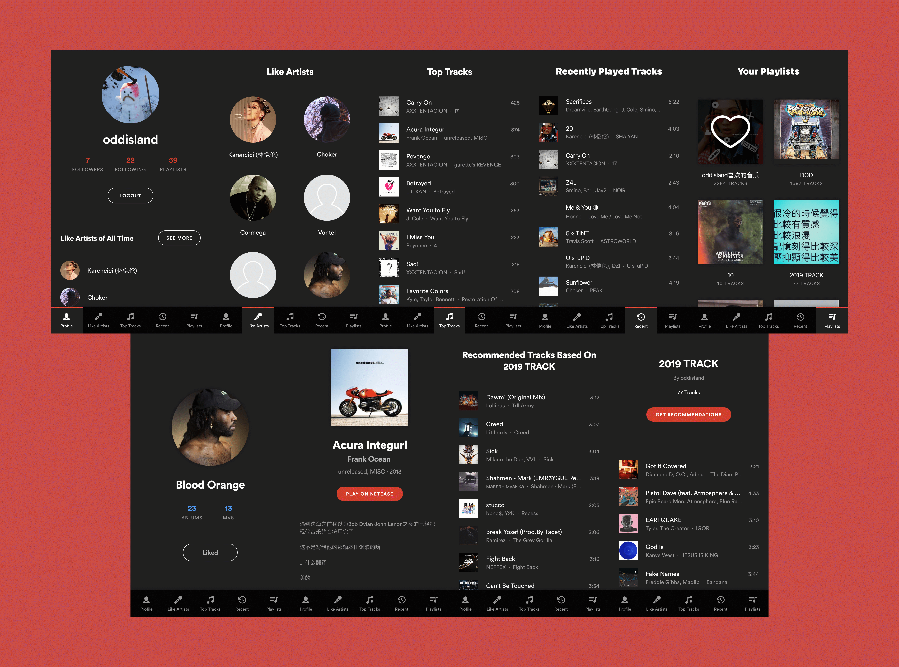

# Netease Profile

> A web app for visualizing personalized NeteaseMusic data



Built with a bunch of things, but to name a few:

- NeteaseCloudMusicApi
- Styled Component
- @reach/router

# Setup

1. `yarn && yarn client:install`
2. `yarn dev`

# Deploy

1. Create new heroku app

  ```bash
    herou create netease-profile
  ```

2. Push to heroku

  ```bash
    git push heroku master
  ```

3. Once the app is live on Heroku, hitting https://netease-profile.herokuapp.com/